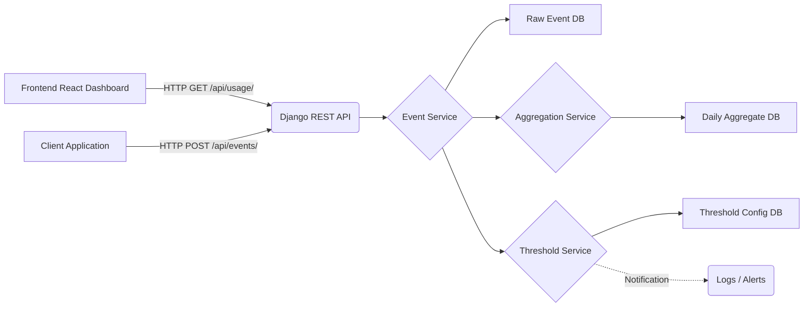

# Architecture: Usage Insights SaaS Feature

## 1. High-Level Architecture Diagram

## 2. Data Flow
1. **Ingestion**: A client sends a `POST` request to `/api/events/` containing the usage payload.
2. **Storage**: The API immediately stores the raw event in the `Event` table.
3. **Aggregation**: In the same transaction/request cycle, the `AggregationService` updates the `DailyUsageAggregate` table by atomically incrementing the count for that specific `(account, team, feature, date)` combination using Django's `F()` expressions.
4. **Evaluation**: The `ThresholdService` evaluates the updated aggregate against the configured `Threshold` for that feature. If exceeded, an asynchronous notification (currently mocked as a synchronous log) is triggered.
5. **Retrieval**: The React dashboard fetches the aggregated data via `GET /api/usage/`. The API performs `GROUP BY` operations strictly on the `DailyUsageAggregate` table, keeping dashboard load times consistently fast regardless of raw event volume.

## 3. API Design
- `POST /api/events/` (Ingestion)
  - **Purpose**: Ingest raw usage events.
  - **Payload**: `{ account_id, user_id, team_id (optional), event_type, feature_name, metadata, timestamp }`
  - **Response**: `201 Created` on success. Validation errors return `400 Bad Request`.
- `GET /api/usage/?account_id=<id>` (Query)
  - **Purpose**: Retrieve usage insights for a given account.
  - **Response**: Returns a JSON object with three arrays: `daily_usage`, `feature_usage`, and `team_usage`, pre-formatted for direct charting in the frontend.
- `GET /api/thresholds/?account_id=<id>` (Thresholds)
  - **Purpose**: Retrieve active threshold configurations for a given account.
  - **Response**: List of configured feature thresholds.
- `POST /api/thresholds/` (Thresholds)
  - **Purpose**: Create or update threshold limits.
  - **Payload**: `{ account_id, feature_name, limit }`

## 4. Data Model Explanation
- **Core Entities (`Account`, `User`, `Team`)**: Represent the multi-tenant SaaS hierarchy.
- **`Event`**: Stores the raw, immutable event log for auditing and historical backfilling.
- **`DailyUsageAggregate`**: A highly granular rollup table constrained by `unique_together = ('account', 'team', 'feature_name', 'date')`. This design implicitly satisfies the need to query by day, by team, or by feature by performing simple `Sum()` aggregations at read time.
- **`Threshold`**: Defines upper limits for feature usage per account.

## 5. Scaling Strategy

### First 6 Months (MVP phase)
- **Database**: PostgreSQL handles both raw events and aggregates. Proper indexing on `Event` and `DailyUsageAggregate` is sufficient.
- **Processing**: Synchronous inline processing (as currently implemented) works well for lower traffic volumes.
- **Compute**: Stateless Django containers deployed on a standard PaaS (e.g., Heroku, AWS ECS) behind a load balancer.

### Later Scale (High Volume)
- **Asynchronous Ingestion**: Shift `POST /api/events/` to an event-driven model. The endpoint will publish payloads to a message broker (Kafka/RabbitMQ) and return `202 Accepted` immediately.
- **Stream Processing & Alerts**: Dedicated worker services (e.g., Celery or Flink) will consume the queue, batch write raw events, periodically update the `DailyUsageAggregate` table to reduce write contention, and asynchronously process threshold alerts via webhooks or emails.
- **Data Warehousing**: Move raw `Event` storage out of the primary transactional database and into a columnar datastore (like ClickHouse or Snowflake) or cold storage (S3) for advanced analytics.
- **Caching**: Implement Redis caching for the `GET /api/usage/` endpoint to handle heavy read traffic from the dashboard.

## 6. Tradeoffs Made
- **Synchronous Aggregation vs Async**: For this slice, aggregates and thresholds are calculated synchronously during the HTTP request. This is simple and highly consistent, but it increases latency for the ingestion endpoint. An async queue is required for production scale.
- **Single Aggregate Table vs Multiple Pre-computed Tables**: We used a single, highly-granular `DailyUsageAggregate` table instead of three separate tables for `Daily`, `Team`, and `Feature` usage. This slows down the read query slightly (requiring a dynamic `GROUP BY`) but drastically simplifies the write path and prevents data anomaly/drift between multiple aggregate tables.
- **Logging for Notifications**: Notification delivery is mocked using standard output logs rather than integrating an external service (like SendGrid or Slack) to keep the project scoped tightly to the core assignment requirements.
